# Desain Skema Basis Data & ERD SIMPUL

> Dokumen ini adalah rancangan model data lengkap untuk Sistem Informasi Manajemen Pembelajaran & Urusan Lembaga (SIMPUL) mengacu pada **PRD Bagian 8**.
> **Catatan:** Sesuai batasan Minggu 2, dokumen ini murni dokumen desain dan pemetaan relasi. Migrasi tabel bisnis baru akan dieksekusi bertahap pada Minggu 3 dan seterusnya.

---

## 1. Diagram ERD Lengkap (Mermaid)

```mermaid
erDiagram
    SEKOLAH ||--o{ TAHUN_AJARAN : "memiliki"
    SEKOLAH ||--o{ JURUSAN : "memiliki"
    SEKOLAH ||--o{ RUANG : "memiliki"
    SEKOLAH ||--o{ MATA_PELAJARAN : "memiliki"
    SEKOLAH ||--o{ PEGAWAI : "mempekerjakan"
    SEKOLAH ||--o{ SISWA : "mendaftar"
    SEKOLAH ||--o{ JAM_KERJA : "mengatur"
    SEKOLAH ||--o{ HARI_LIBUR : "menetapkan"
    SEKOLAH ||--o{ TITIK_ABSEN : "memiliki"
    SEKOLAH ||--o{ IMPORT_BATCHES : "melakukan"

    TAHUN_AJARAN ||--o{ SEMESTER : "terdiri atas"
    SEMESTER ||--o{ ROMBEL : "membuka"
    SEMESTER ||--o{ ALOKASI_JAM_MAPEL : "menetapkan"
    SEMESTER ||--o{ JADWAL_PELAJARAN : "berlaku"
    SEMESTER ||--o{ ANGGOTA_ROMBEL : "berjalan"

    ROMBEL ||--o{ ANGGOTA_ROMBEL : "berisi"
    ROMBEL }|..|| JURUSAN : "opsional jurusan"
    ROMBEL }|..|| PEGAWAI : "wali kelas"
    ROMBEL }|..|| RUANG : "ruang homebase"
    ROMBEL ||--o{ JADWAL_PELAJARAN : "dijadwalkan"

    SISWA ||--o{ ANGGOTA_ROMBEL : "masuk rombel"
    SISWA ||--o{ WALI_SISWA : "memiliki kontak"
    SISWA ||--o{ BERKAS_SISWA : "memiliki berkas"
    SISWA ||--o{ MUTASI_SISWA : "memiliki riwayat mutasi"

    USERS ||--o| PEGAWAI : "akun pegawai"
    PEGAWAI ||--o{ ABSENSI : "mencatat kehadiran"
    PEGAWAI ||--o{ PENGAJUAN_IZIN : "mengajukan izin"
    PEGAWAI ||--o{ JADWAL_PELAJARAN : "mengajar"
    PEGAWAI ||--o{ PERSETUJUAN_IZIN : "menyetujui"

    MATA_PELAJARAN ||--o{ ALOKASI_JAM_MAPEL : "dialokasikan"
    MATA_PELAJARAN ||--o{ JADWAL_PELAJARAN : "dijadwalkan"
    RUANG ||--o{ JADWAL_PELAJARAN : "tempat belajar"

    PENGAJUAN_IZIN ||--o{ PERSETUJUAN_IZIN : "memerlukan"
    ABSENSI ||--o| IDEMPOTENCY_KEYS : "idempotent request"

    IMPORT_BATCHES ||--o{ IMPORT_ROWS : "berisi baris"

    SEKOLAH {
        uuid id PK
        string npsn UK "8 digit unik"
        string nama
        string jenjang "sd | smp | sma | smk"
        string status "negeri | swasta"
        text alamat
        decimal latitude
        decimal longitude
        int radius_absen_meter "default 150m"
        string logo_path
        string akreditasi "A | B | C | Belum"
        timestamp created_at
        timestamp updated_at
        timestamp deleted_at
    }

    TAHUN_AJARAN {
        uuid id PK
        uuid sekolah_id FK
        string nama "2025/2026"
        date tanggal_mulai
        date tanggal_selesai
        boolean is_aktif "partial unique per sekolah"
    }

    SEMESTER {
        uuid id PK
        uuid tahun_ajaran_id FK
        string tipe "ganjil | genap"
        date tanggal_mulai
        date tanggal_selesai
        boolean is_aktif
    }

    ROMBEL {
        uuid id PK
        uuid sekolah_id FK
        uuid semester_id FK
        string nama "X-A, XII-RPL-1"
        int tingkat "1..12"
        uuid jurusan_id FK "nullable"
        uuid wali_kelas_id FK "unique per semester"
        uuid ruang_id FK "nullable"
        int kuota
    }

    SISWA {
        uuid id PK
        uuid sekolah_id FK
        string nisn UK "10 digit unik global"
        string nik "16 digit"
        string nama
        string jenis_kelamin "L | P"
        string tempat_lahir
        date tanggal_lahir
        string agama
        text alamat
        string no_hp
        string status "aktif | lulus | pindah | do"
        uuid import_batch_id FK "nullable"
        timestamp created_at
        timestamp updated_at
        timestamp deleted_at
    }

    ANGGOTA_ROMBEL {
        uuid id PK
        uuid rombel_id FK
        uuid siswa_id FK
        uuid semester_id FK "unique(semester_id, siswa_id)"
        int nomor_absen
    }

    WALI_SISWA {
        uuid id PK
        uuid siswa_id FK
        string hubungan "ayah | ibu | wali"
        string nama
        string pekerjaan
        string no_hp
        text alamat
    }

    BERKAS_SISWA {
        uuid id PK
        uuid siswa_id FK
        string jenis "ijazah | akta | kk | foto"
        string file_path
        string mime_type
        int file_size_bytes
    }

    MUTASI_SISWA {
        uuid id PK
        uuid siswa_id FK
        uuid semester_id FK
        string tipe "masuk | keluar"
        date tanggal
        string asal_tujuan_sekolah
        text alasan
    }

    USERS {
        uuid id PK
        uuid sekolah_id FK "nullable untuk super admin"
        string name
        string email UK
        timestamp email_verified_at
        string password
        string remember_token
        timestamp created_at
        timestamp updated_at
    }

    PEGAWAI {
        uuid id PK
        uuid sekolah_id FK
        uuid user_id FK "nullable"
        string nuptk "16 digit"
        string nip "18 digit"
        string nama
        string jenis "guru | tu | kepsek"
        string status_kepegawaian "pns | p3k | gtt | gty | honorer"
        int jam_maks_per_minggu
        jsonb hari_tidak_mengajar "array hari [1..6]"
        timestamp created_at
        timestamp updated_at
        timestamp deleted_at
    }

    JURUSAN {
        uuid id PK
        uuid sekolah_id FK
        string kode "RPL, TKJ, IPA"
        string nama
        string jenjang "smk | sma"
    }

    RUANG {
        uuid id PK
        uuid sekolah_id FK
        string kode "R-101, LAB-KOMP"
        string nama
        string kategori "kelas | lab | bengkel | aula | olahraga"
        int kapasitas
    }

    MATA_PELAJARAN {
        uuid id PK
        uuid sekolah_id FK
        string kode "MAT, BIND, PROG"
        string nama
        string kelompok "umum | kejuruan | muatan_lokal"
        string butuh_ruang_kategori "nullable"
        int bobot_berat "1..5 beban kognitif"
    }

    ALOKASI_JAM_MAPEL {
        uuid id PK
        uuid semester_id FK
        uuid mata_pelajaran_id FK
        int tingkat
        uuid jurusan_id FK "nullable"
        int jam_per_minggu
    }

    JADWAL_PELAJARAN {
        uuid id PK
        uuid sekolah_id FK
        uuid semester_id FK
        uuid rombel_id FK
        uuid mata_pelajaran_id FK
        uuid guru_id FK
        uuid ruang_id FK "nullable"
        int hari "1=Senin..6=Sabtu"
        int jam_mulai_ke "1..12"
        int jam_selesai_ke "1..12"
        timestamp created_at
        timestamp updated_at
        timestamp deleted_at
    }

    JAM_KERJA {
        uuid id PK
        uuid sekolah_id FK
        string kelompok "guru | tu | umum"
        int hari "1..7"
        time jam_masuk
        time jam_pulang
        int toleransi_menit
        boolean is_libur
    }

    HARI_LIBUR {
        uuid id PK
        uuid sekolah_id FK
        date tanggal_mulai
        date tanggal_selesai
        string keterangan
    }

    TITIK_ABSEN {
        uuid id PK
        uuid sekolah_id FK
        string nama "Gerbang Utama, Lobi"
        text secret "terenkripsi"
        decimal latitude
        decimal longitude
        boolean is_aktif
    }

    ABSENSI {
        uuid id PK
        uuid sekolah_id FK
        uuid pegawai_id FK
        date tanggal
        string jenis "masuk | pulang"
        timestamp waktu_server
        timestamp waktu_perangkat
        string status "hadir | terlambat | pulang_cepat | alfa"
        int menit_terlambat
        decimal latitude
        decimal longitude
        boolean lokasi_valid
        boolean perlu_ditinjau
        string sumber "qr | manual | import"
        uuid client_uuid UK
        uuid dicatat_oleh FK "nullable"
        text alasan_manual
        timestamp created_at
        timestamp updated_at
        timestamp deleted_at
    }

    IDEMPOTENCY_KEYS {
        string key PK
        uuid sekolah_id FK
        string endpoint
        jsonb response_body
        int status_code
        timestamp expires_at
    }

    PENGAJUAN_IZIN {
        uuid id PK
        uuid sekolah_id FK
        uuid pegawai_id FK
        string jenis_izin "sakit | cuti | dinas | urusan_keluarga"
        date tanggal_mulai
        date tanggal_selesai
        text alasan
        string lampiran_path
        string status "draft | menunggu | disetujui | ditolak | dibatalkan"
        timestamp created_at
        timestamp updated_at
    }

    PERSETUJUAN_IZIN {
        uuid id PK
        uuid pengajuan_izin_id FK
        int urutan
        uuid approver_id FK
        string status "menunggu | disetujui | ditolak"
        text catatan
        timestamp diputuskan_pada
    }

    IMPORT_BATCHES {
        uuid id PK
        uuid sekolah_id FK
        uuid user_id FK
        string tipe "siswa | pegawai"
        string nama_file
        string path
        jsonb pemetaan_kolom
        int total_baris
        int valid
        int peringatan
        int gagal
        int dibuat
        int diperbarui
        int dilewati
        string status "uploaded | mapping | validating | preview | importing | done | failed | rolled_back"
        timestamp dapat_dirollback_hingga
    }

    IMPORT_ROWS {
        uuid id PK
        uuid import_batch_id FK
        int nomor_baris
        jsonb data_mentah
        jsonb data_bersih
        string status "valid | peringatan | gagal | diimpor | dilewati"
        jsonb errors
        string aksi_duplikat
        uuid model_id "nullable"
    }
```

---

## 2. Aturan Lintas Tabel & Integritas Data

| Kode   | Aturan                      | Implementasi Teknis                                                                                                                                                 |
| ------ | --------------------------- | ------------------------------------------------------------------------------------------------------------------------------------------------------------------- |
| **D1** | Multi-tenancy diskriminator | Semua tabel transaksional memiliki kolom `sekolah_id` yang diisi otomatis via trait `BelongsToSekolah` dan difilter via Global Scope.                               |
| **D2** | Periode akademik            | Data transaksional akademik (rombel, anggota rombel, alokasi jam, jadwal pelajaran) terikat ke `semester_id`.                                                       |
| **D3** | Soft Deletes                | Data `siswa`, `pegawai`, `sekolah`, dan `jadwal_pelajaran` tidak pernah di-hard-delete (`SoftDeletes`).                                                             |
| **D4** | Audit Trail                 | Seluruh mutasi entitas inti dilacak via `spatie/laravel-activitylog`.                                                                                               |
| **D5** | Integer untuk Waktu & Nilai | `menit_terlambat`, kapasitas, dan durasi disimpan sebagai integer murni (menghindari float precision issue).                                                        |
| **D6** | Timezone UTC                | Disimpan di DB sebagai UTC, dikonversi saat presentasi frontend ke `Asia/Jakarta`.                                                                                  |
| **D7** | No Database Enum            | Status dan jenis disimpan sebagai `varchar/string` dan divalidasi lewat PHP 8.3 Backed Enums di level aplikasi.                                                     |
| **D8** | Exclusion Constraint        | Pada tabel `jadwal_pelajaran`, bentrok guru/ruang/rombel dicegah menggunakan PostgreSQL `EXCLUDE USING gist` dengan tipe `int4range(jam_mulai_ke, jam_selesai_ke)`. |
| **D9** | Partial Unique Index        | `UNIQUE (sekolah_id) WHERE is_aktif = true` pada tabel `tahun_ajaran` menjamin hanya satu tahun ajaran aktif per sekolah.                                           |
