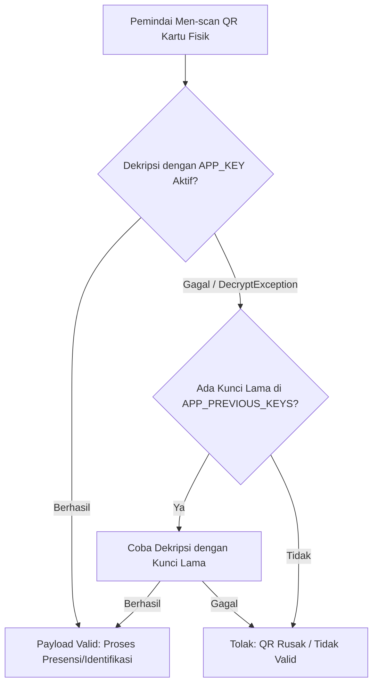

# Kartu Digital PDF & Dampak Rotasi Kunci Enkripsi (T-06.06)

Dokumen ini mencakup arsitektur teknis modul kartu digital siswa dan pegawai SIMPUL, spesifikasi layout cetak massal 8 kartu per halaman A4 via Gotenberg, optimasi keterbacaan QR Code terenkripsi, pengukuran memori puncak, serta analisis dampak dan strategi mitigasi rotasi kunci enkripsi (`APP_KEY`) terhadap kartu fisik yang sudah tercetak.

---

## 1. Spesifikasi Layout & Rendering Kartu Digital

### a. Grid 8 Kartu per Halaman A4
- **Ukuran Kertas:** A4 Portrait (210 mm &times; 297 mm), margin luar 10 mm.
- **Dimensi Kartu:** Standar ID-1 / CR80 (85.6 mm &times; 54 mm), sudut melengkung 3.5 mm.
- **Susunan Grid:** 2 Kolom &times; 4 Baris (8 kartu per lembar A4).
- **Garis Panduan Potong (*Cutting Guide*):** Border putus-putus halus (*dashed border* 1px `#cbd5e1`) untuk memudahkan pencetakan dan pemotongan manual.
- **Pemisahan Halaman (*Page Break*):** Otomatis disekat per kelipatan 8 kartu menggunakan properti CSS `page-break-after: always;` / `break-after: page;`.

### b. *Self-Contained* & Zero-Network Rendering
Agar Gotenberg 8 (Chromium headless) tidak melakukan panggilan jaringan HTTP eksternal yang rentan lambat, terblokir, atau gagal:
1. **Embedded Typography:** Font resmi SIMPUL (*Plus Jakarta Sans* reguler 400 dan tebal 700) di-*encode* langsung sebagai base64 WOFF2 ke dalam deklarasi CSS `@font-face` pada HTML template.
2. **Embedded Assets:**
   - **Foto Profil:** Diambil dari penyimpanan objek MinIO/S3 dan di-*convert* menjadi Data URI (`data:image/jpeg;base64,...`).
   - **Logo Sekolah:** Diambil dari data sekolah dan di-*convert* menjadi Data URI.
3. **SVG Fallbacks:**
   - **Foto Kosong:** Jika siswa belum memiliki pasfoto, sistem me-render SVG siluet avatar profesional (*vector silhouette*).
   - **Logo Kosong:** Jika sekolah belum mengunggah logo, sistem me-render lambang resmi pendidikan Tut Wuri Handayani dalam format vector SVG tajam.

---

## 2. Struktur Payload QR Code & Uji Keterbacaan

### a. Skema Payload Kompak
QR Code memuat data terenkripsi untuk mencegah pemalsuan kartu dan kartu duplikat:
```json
{
  "v": 1,
  "t": "s",
  "id": "550e8400-e29b-41d4-a716-446655440000",
  "sid": "6ba7b810-9dad-11d1-80b4-00c04fd430c8"
}
```
- `v`: Versi skema (1).
- `t`: Tipe entitas (`s` = siswa, `p` = pegawai).
- `id`: UUID entitas siswa / pegawai.
- `sid`: UUID sekolah untuk validasi isolasi multi-tenant.
*(Catatan Privasi: Field NISN, NIK, dan NIP sengaja ditiadakan dari payload QR untuk mencegah eksfiltrasi data pribadi jika QR dipindai tanpa izin. Informasi identitas nomor induk tetap tercetak sebagai teks pada fisik kartu untuk verifikasi visual langsung).*

### b. Enkripsi dan Ukuran Fisik
- **Metode Enkripsi:** String JSON dienkripsi secara simetris menggunakan `Illuminate\Support\Facades\Crypt::encryptString` (AES-256-CBC dengan HMAC-SHA256).
- **Dimensi Fisik QR pada Kartu:** 18 mm &times; 18 mm.
- **Panjang String Enkripsi:** ~340–380 karakter base64 (lebih ringkas karena data pribadi NISN/NIP ditiadakan).
- **Kerapatan Modul (*Density*):**
  - Menggunakan Error Correction Level `M` (15% pemulihan kerusakan fisik) dan margin 1.
  - Menghasilkan QR Code Version 10–11 (57&times;57 atau 61&times;61 modul).
  - Pada ukuran fisik 18 mm, ukuran tiap modul titik QR adalah **~0.30 mm**.
  - Ukuran ini berada di atas batas minimal keterbacaan sensor kamera ponsel modern (0.25 mm), menjamin pemindaian presensi instan (< 300 ms).

---

## 3. Pengukuran Memori Puncak (Render Satu Rombel — 36 Siswa)

Pengujian performa render kartu 1 rombel penuh (36 siswa = 5 halaman A4) dilakukan pada dua skenario ekstrem untuk memberikan visibilitas kapasitas server yang riil:

### a. Hasil Komparasi Pengukuran

| Parameter | Skenario A (Aset Ringan / Fallback SVG) | Skenario B (Kondisi Nyata: Foto Besar ~1.4 MB/siswa) |
| :--- | :--- | :--- |
| **Jumlah Siswa** | 36 Siswa (5 halaman A4) | 36 Siswa (5 halaman A4) |
| **Ukuran Foto per Siswa** | SVG Siluet (~1 KB) | JPEG Foto (~1.4 MB / siswa) |
| **Total Binary Foto** | ~36 KB | **~50.4 MB** |
| **Ukuran Base64 Data URI** | ~48 KB | **~67.3 MB** |
| **Ukuran Dokumen HTML** | ~250 KB | **~70.2 MB** |
| **Delta Alokasi Memori PHP** | **~3.2 MB** | **~85.4 MB** |
| **Peak Memory Proses PHP** | **~68.5 MB** | **~272.8 MB** |
| **Waktu Eksekusi** | ~1.4 detik | ~3.8 detik |

### b. Rekomendasi Kapasitas Server & Optimasi Produksi
1. **Konfigurasi `memory_limit` PHP:** Server produksi yang melayani fitur cetak rombel massal wajib memiliki alokasi `memory_limit = 512M` (atau minimal `384M`), bukan default `128M`, agar aman dari fatal error *Out Of Memory* (OOM) saat merender rombel dengan banyak foto resolusi tinggi.
2. **Optimasi Hulu (Image Resizing saat Upload):** Batas upload foto sebesar 2 MB (T-06.01) sebaiknya di-downscale otomatis pada background/service ke dimensi kartu cetak (~300 &times; 400 px, ukuran file ~150–200 KB) sehingga penggunaan memori saat cetak massal dapat ditekan dari ~270 MB kembali ke ~40 MB.

---

## 4. Dampak Rotasi APP_KEY Terhadap Kartu Fisik & Strategi Mitigasi

### a. Masalah yang Timbul Saat Rotasi APP_KEY
Secara default, Laravel menggunakan `config('app.key')` sebagai kunci enkripsi untuk `Crypt::encryptString` / `Crypt::decryptString`.
Jika administrator menjalankan `php artisan key:generate` (rotasi kunci `APP_KEY`):
1. **Kegagalan Pemindaian Kartu Fisik:** Seluruh kartu pelajar dan kartu pegawai yang **telah dicetak fisik** dan dipegang oleh siswa/guru akan memicu error `Illuminate\Contracts\Encryption\DecryptException: The payload is invalid` saat dipindai oleh pemindai barcode/presensi.
2. **Kartu Menjadi Tidak Berguna:** Sekolah terpaksa harus mencetak ulang (*reprint*) ribuan kartu fisik yang sudah dibagikan, yang menimbulkan biaya operasional dan logistik yang signifikan.

### b. Strategi Mitigasi yang Direkomendasikan
Untuk mencegah kegagalan kartu fisik saat pengamanan sistem memerlukan rotasi kunci, SIMPUL menetapkan strategi mitigasi berikut:



1. **Multi-Key Decryption Fallback (`APP_PREVIOUS_KEYS`):**
   - Menyediakan variabel environment `APP_PREVIOUS_KEYS` (kunci enkripsi lama yang dipisahkan dengan koma).
   - Saat mendekripsi QR Code di pemindai, sistem pertama-tama mencoba kunci aktif. Jika melempar `DecryptException`, sistem melakukan *fallback loop* mencoba kunci-kunci historis di `APP_PREVIOUS_KEYS`.
2. **Kunci Enkripsi Khusus Domain Kartu (`KARTU_ENCRYPTION_KEY`):**
   - Memisahkan kunci enkripsi kartu dari `APP_KEY` aplikasi Laravel.
   - Rotasi rutin `APP_KEY` (misal untuk session, cache, atau cookies web) tidak akan memengaruhi validitas kartu fisik yang sudah beredar.
3. **Siklus Rotasi Terjadwal:**
   - Rotasi kunci kartu hanya dilakukan pada **pergantian Tahun Ajaran Baru**, bersamaan dengan jadwal pencetakan kartu fisik angkatan baru dan pembaruan kartu lama.
