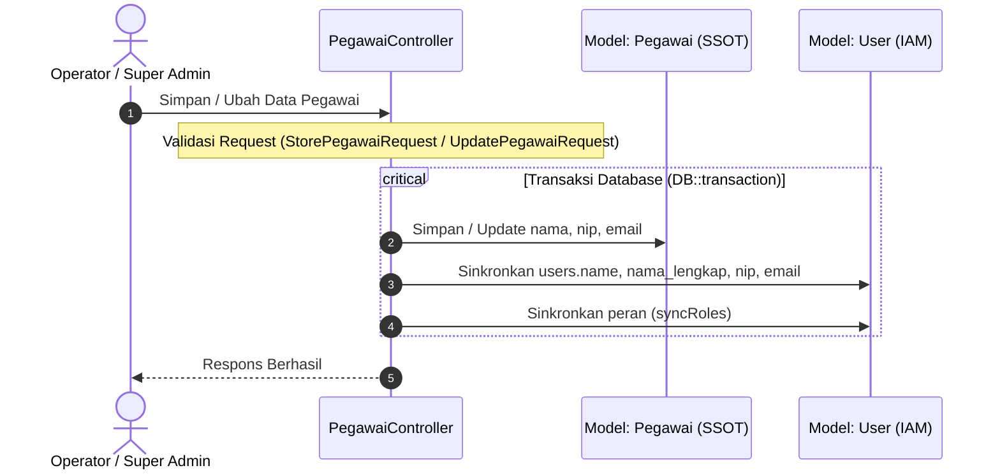

# Sumber Kebenaran Tunggal (Single Source of Truth) — Data Pegawai vs Akun Pengguna

Dokumen ini menjelaskan keputusan arsitektur terkait penataan atribut `nama`, `nip`, dan `email` antara tabel `pegawai` dan `users` di SIMPUL, penetapan sumber kebenaran utama, integritas audit log, serta mekanisme sinkronisasi otomatis dan soft-delete sesuai aturan PRD 1.2 dan D3 ("data tidak pernah hilang").

---

## 1. Penetapan Sumber Kebenaran (Single Source of Truth)

> **Keputusan:** Tabel `pegawai` adalah **sumber kebenaran tunggal (Primary Source of Truth)** untuk seluruh data identitas dan kontak pegawai, termasuk `nama`, `nip`, dan `email`.

Tabel `users` berperan sebagai **entitas akun autentikasi dan otorisasi (Identity & Access Management / IAM)**, bukan entitas profil induk kepegawaian.

---

## 2. Mengapa Kolom Tersebut Ada di Kedua Tabel?

Meskipun tabel `pegawai` menjadi acuan utama, kolom `name`, `nama_lengkap`, `nip`, dan `email` tetap dipertahankan di tabel `users` karena alasan teknis berikut:

### a. Kompatibilitas Framework dan Starter Kit
- Ekosistem Laravel (Fortify, Sanctum, Inertia starter kit) secara default bergantung pada `users.name` dan `users.email` untuk rendering profil header, breadcrumb pengguna, session state, dan penanganan autentikasi bawaan.
- Membaca `user.name` secara langsung pada session payload auth menghindari query join atau eager loading relasi `pegawai` pada setiap siklus request HTTP reguler.

### b. Fleksibilitas Multi-Aktor (Aktor Non-Pegawai)
- SIMPUL melayani aktor yang tidak memiliki catatan kepegawaian, seperti `super_admin` platform dan akun `orang_tua` (wali siswa).
- Jika `name`, `nip`, atau `email` hanya berada di tabel `pegawai`, tabel `users` tidak akan mampu merepresentasikan identitas nama pengguna non-pegawai secara seragam.

### c. Mekanisme Multi-Identifier Login
- Tabel `users` mendukung login ganda: login berbasis `email` dan login berbasis `nip`.
- Indeks unik parsial `users_sekolah_id_nip_unique` dan `users_email_unique` pada tabel `users` memungkinkan pengecekan kredensial login secara langsung pada layer autentikasi tanpa harus melakukan query silang ke tabel domain `pegawai`.

### d. Penanganan Atribut Email
- `users.email` adalah kredensial login unik akun.
- `pegawai.email` adalah email kontak dinas/kepegawaian.
- **Arah Sinkronisasi Email:** Satu arah (*unidirectional*) dari `pegawai.email` disinkronkan ke `users.email` saat pembuatan (create) dan pembaruan (update) data pegawai.

---

## 3. Kebijakan Penghapusan & Integritas Audit (PRD 1.2 & D3)

Sesuai prinsip inti SIMPUL bahwa **"data tidak pernah hilang" (D3: SoftDeletes + status arsip)**:

1. **Dual Soft-Delete (Bukan Hard-Delete):**
   - Saat pegawai dihapus via `PegawaiController::destroy`, sistem melakukan **soft-delete** pada `Pegawai` (`pegawai.deleted_at`) dan secara bersamaan melakukan **soft-delete** pada akun `User` terkait (`users.deleted_at`).
   - Baris record pengguna **TIDAK PERNAH DIHAPUS (hard-delete)** dari basis data.
2. **Penonaktifan Akses Login:**
   - Setelah akun `User` di-soft-delete, pengguna tidak dapat lagi melakukan login karena Eloquent user provider Laravel secara otomatis menambahkan kondisi `WHERE deleted_at IS NULL`.
3. **Integritas Jejak Audit Log (`causer_id`):**
   - Kolom `causer_id` pada tabel `activity_log` tetap utuh merujuk ke baris record `users` terkait.
   - Relasi audit historis tidak terputus (*no broken links / null causer*) karena baris pengguna tetap tersimpan di tabel `users`.
4. **Pembebasan Keunikan Email dan NIP:**
   - Keunikan `email` dan `nip` ditegakkan menggunakan **partial unique index** (`WHERE deleted_at IS NULL`), persis seperti pola NISN pada siswa.
   - Ketika seorang pegawai dinonaktifkan (di-soft-delete), email atau NIP tersebut dapat digunakan kembali bila diperlukan di masa mendatang tanpa menimbulkan pelanggaran konstrain basis data.
5. **Pemulihan Otomatis (Restore):**
   - Model `Pegawai` dilengkapi event hook `restoring` di method `booted()`.
   - Saat `$pegawai->restore()` dijalankan, akun pengguna terkait (`$pegawai->user()->withTrashed()`) otomatis di-restore dan diaktifkan kembali.

---

## 4. Mekanisme Sinkronisasi Otomatis

---

## 5. Item Terbuka (Open Items)

1. **Terminasi Sesi Aktif Saat Soft-Delete:**
   - Saat akun pengguna di-soft-delete, percobaan login baru segera ditolak oleh sistem autentikasi (`WHERE deleted_at IS NULL`). Namun, sesi login yang sedang aktif (*session cookies / remember-me*) tidak otomatis terputus seketika pada siklus request berjalan tanpa adanya session revocation eksplisit (misalnya `DB::table('sessions')->where('user_id', $id)->delete()`).
   - Hal ini dicatat sebagai item terbuka untuk evaluasi mekanisme invalidasi sesi/token real-time di rilis mendatang.
